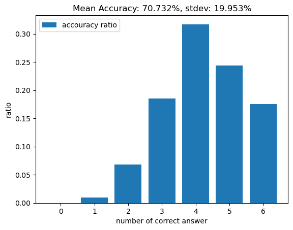
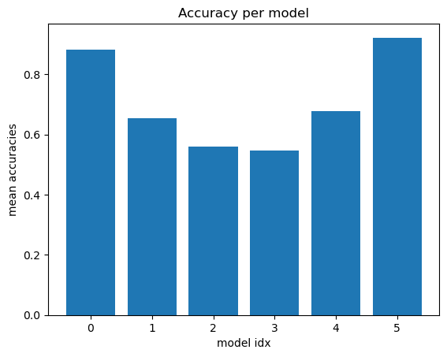
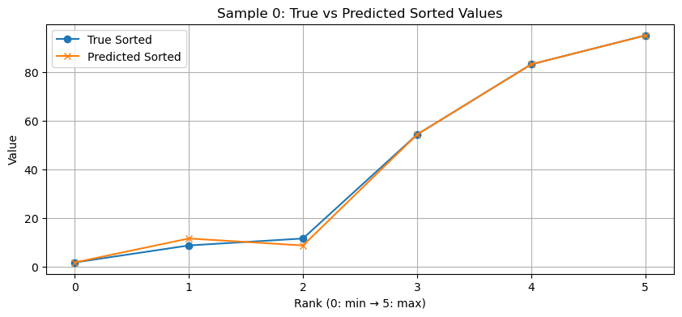
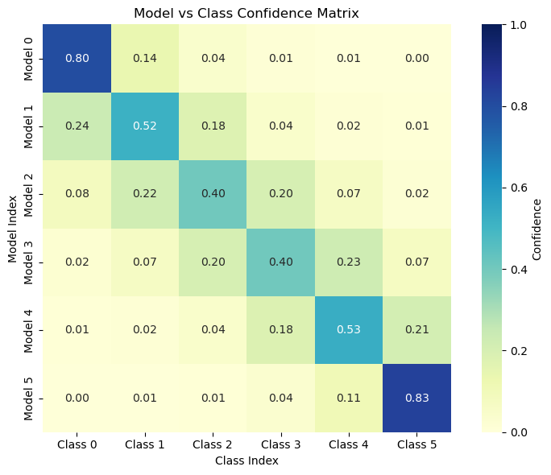

# 🔢 Sorting with MLP

## 📕 Overview

Is it possible to sort a randomly ordered vector using only a Multi-Layer Perceptron (MLP)?  
Of course, traditional algorithms like quicksort are orders of magnitude faster and more efficient.  
But curiosity got the better of me.

Instead of directly sorting the values, this project uses an indirect method: predicting the **index** of each value in the sorted order.  
Since sorting is inherently a **nonlinear** operation, sorting \( N \) classes would require approximately \( \log N \) nonlinear transformations.  
So, could a stack of ~log(N) MLP layers sort N items?

This project investigates that question using a deep learning approach.

---

## 📌 Methodology

- Let **N** be the number of elements to sort (i.e., number of classes).
- The dataset consists of input vectors `X`:
  - Each `X` is a vector of N random floats in the range [0, 100], shuffled.
- The labels `Y` are generated as follows:
  - `Y0`: One-hot encoding of the index (in the original X) of the **largest** value.
  - `Y1`: One-hot encoding of the index of the **second largest** value.
  - ...
  - `YN-1`: One-hot encoding of the index of the **smallest** value.

Each position in the sorted array is predicted by a **dedicated MLP** model:
- The 1st MLP predicts which index should be placed in position 0 (i.e., largest value).
- The 2nd MLP predicts the index for position 1, and so on.
- Each model is trained with **cross-entropy loss** between predicted distribution and the one-hot label.

During inference:
- The N models each predict one index.
- The original X vector is re-ordered according to the predicted indices.
- The result is compared with the truly sorted X vector to evaluate accuracy.

---

## 🏗️ Architecture

Each MLP model has the following structure:

- Input: `N`-dimensional vector
- Layers:  
  - Linear → BatchNorm → GELU → Dropout  
  - (Repeated several times)
  - Final Linear layer to produce N-class logits
- Loss: CrossEntropyLoss
- Optimizer: Adam

---

## 📊 Informations and Hyperparameters

- **N = 6** (number of elements to sort)
- **Dataset size**: 1024
- **Train size**: 819 samples (80%)
- **Validation size**: 205 samples (20%)
- **Epochs**: 200  
- **Batch size**: 64  
- **Learning rate**: 3e-4  

### 🔍 Results and Discussion

<table>
  <tr>
    <td></td>
    <td></td>
  </tr>
</table>

- We can check that predicting extreme value(maximum or minimum) is relatively correctly conducted.
- Also, you can see that it is relatively difficult to accurately determine the index of the median.
- MLPs can be interpreted as being able to "approximate" alignment rather than performing it exactly.

- We can see that there is some confusion about the central values.

- Models that predict extreme values ​​predict values ​​with relatively high confidence, whereas models that predict the central median have relatively low confidence.

---

## 🚫 Limitations

- No guarantee of valid permutations in output (i.e., same index may be predicted twice).
- Models are independent. They can't refer to each other. 

---

## 🛠️ Requirements

- torch>=2.0.0
- numpy>=1.23
- matplotlib>=3.5
- d2l==1.0.3
- ipykernel

or you can refer to the requirements.txt.

## 📄 License

MIT © HiverXD